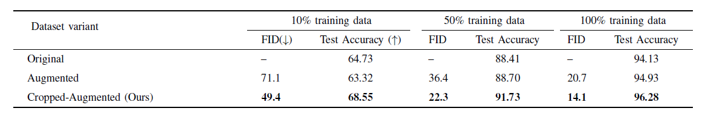
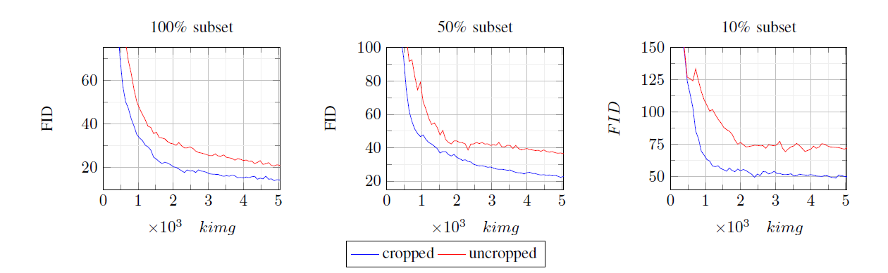
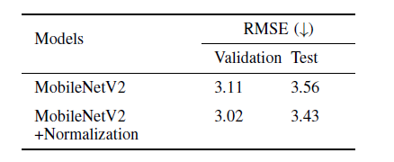

# GANs Augmented Pet Classifier

> ### Towards Fine-grained Image Classification with Generative Adversarial Networks and Facial Landmark Detection
> _Mahdi Darvish, Mahsa Pouramini, Hamid Bahador_

> arixv :llinkkk

Abstract: _Fine-grained   classification   remains   a   challengingtask  because  distinguishing  categories  needs  learning  complexand  local  differences.  Diversity  in  the  pose,  scale,  and  positionof  objects  in  an  image  makes  the  problem  even  more  difficult.Although  the  recent  Vision  Transformer  models  achieve  highperformance,  they  need  an  extensive  volume  of  input  data.  Toencounter this problem, we made the best use of GAN-based dataaugmentation  to  generate  extra  dataset  instances.  Oxford-IIITPets  was  our  dataset  of  choice  for  this  experiment.  It  consistsof  37  breeds  of  cats  and  dogs  with  variations  in  scale,  poses,and  lighting,  which  intensifies  the  difficulty  of  the  classificationtask.  Furthermore,  we  enhanced  the  performance  of  the  recentGenerative Adversarial Network (GAN), StyleGAN2-ADA modelto generate more realistic images while preventing overfitting tothe  training  set.  We  did  this  by  training  a  customized  versionof  MobileNetV2  to  predict  animal  facial  landmarks;  then,  wecropped  images  accordingly.  Lastly,  we  combined  the  syntheticimages  with  the  original  dataset  and  compared  our  proposedmethod with standard GANs augmentation and no augmentationwith  different  subsets  of  training  data.  We  validated  our  workby  evaluating  the  accuracy  of  fine-grained  image  classificationon the recent Vision Transformer (ViT) Model._

# Results

The measured accuracy of the used model and FID for three different dataset conditions (Original, augmented, and augmented-cropped) in data regimes of 10, 50, and 100 percent:

 
 
Comparison between synthetic and authentic images. This figure show (a) the original data,(b) and (c) generated images on
the whole dataset, cropped and uncropped, respectively. (d) cropped images on 50%, (e) uncropped images generated on 50%
subset and finally (f) and (g), cropped and uncropped images result of training on only 10% of the data. These qualitative
visualizations prove the effectiveness and the interpretability of the method. 

 
 
The charts explain the accuracy of the used model and FID for three different dataset conditions (Original, augmented, and cropped-augmented ) in data regimes of 10, 50, and 100 percent:

 
 
The evaluated RMSE of the trained MobileNetV2 model with
and without landmark normalization:

# Pre-Trained Models

### StyleGAN2-ADA trained on cropped pets dataset 

| Subset | Kimg | FID  | Acc on Vit | Pre-trained Networks|
|--------|------|------|------------|---------------------|
| 10%    | 5120 | 49.4 | 68.55      | [subset_10_cropped.pkl](https://drive.google.com/file/d/1LnzWRR-WOP61yrAA-Pjx8zHZuW-_XTvv/view?usp=sharing)|    
| 50%    | 5120 | 22.3 | 91.73      | [subset_50_cropped.pkl](https://drive.google.com/file/d/1HE1PKRbLt4D92YVX_wMgAVFDaW5ekf2i/view?usp=sharing)|           
| 100%   | 5120 | 14.1 | 96.28      | [subset_100_cropped.pkl](https://drive.google.com/file/d/16rMCYKYOEnlUU0y_5A0vSvfp5SbEnym-/view?usp=sharing)|           

### StyleGAN2-ADA trained on not cropped pets dataset 

| Subset | Kimg | FID  | Acc on Vit | Pre-trained Networks| 
|--------|------|------|------------|---------------------|
| 10%    | 5120 | 71.1 | 63.32      | [subset_10_original.pkl](https://drive.google.com/file/d/17UtNRouNT7OEXZqhAReWzxF94muO5Q5z/view?usp=sharing)|           
| 50%    | 5120 | 36.4 | 88.70      | [subset_50_original.pkl](https://drive.google.com/file/d/1VxXw66_37Q8WM93bORkvTzMY_cNmR1Na/view?usp=sharing)|           
| 100%   | 5120 | 20.7 | 94.93      | [subset_100_original.pkl](https://drive.google.com/file/d/1faWOraVyYiYalN7Y0lGJ7mOJx2eE3zZu/view?usp=sharing)|           

# Getting started
## Dataset

#### Oxford-IIIT Pets Variants:
The official dataset can be reached from:
 

- [Original dataset](https://www.robots.ox.ac.uk/~vgg/data/pets/)
- [Cropped Version](https://drive.google.com/file/d/1guBrFJUW1D8FSkNAKfyxsuCYtmGSgny-/view?usp=sharing)

#### Landmark prediction datasets:

We combined the following datasets for predicting landmarks:

- [Cat dataset from Kaggle](https://www.kaggle.com/crawford/cat-dataset) 
- [Dog dataset from DogFaceNet](https://github.com/GuillaumeMougeot/DogFaceNet/releases/).

## StyleGAN2-ADA Installation
### Running Localy
Requirements for running StyleGAN localy are consist of:
- 64-bit Python 3.7.
- Pytorch and dependencies :

        !pip install torch==1.7.1+cu110 torchvision==0.8.2+cu110 torchaudio==0.7.2 -f https://download.pytorch.org/whl/torch_stable.html

- Python libraries:

        !pip install ninja tqdm ffmpeg

#### Data Preperation
Please prepare the data as following:

    └── root
        ├── gans_training
        │   ├── dataset
        │   │   └── oxford_pets
        │   │       ├── class1
        │   │       │   ├── img1.jpg
        │   │       │   ├── img2.jpg
        │   │       │   └── ...
        │   │       ├── class2
        │   │       │   ├── img1.jpg
        │   │       │   ├── img2.jpg
        │   │       │   └── ...
        │   │       └── class3
        │   │           ├── img1.jpg
        │   │           ├── img2.jpg
        │   │           └── ...
        │   │  
        │   ├── images
        │   │   
        │   └── experiment
        └── stylegan2_ada
        
You need to run the following code to transfer the images to multi-resolution TFRecords (Tensors for all variants of Oxford-IIIT Pets are available at [dataset](#dataset) section):

    !python root/stylegan2-ada-pytorch/dataset_tool.py --source root/gans_training/images --dest root/gans_training/dataset
#### Training
Note: You can also modify and add to the config paramters by checking out official [StyleGAN2-ADA](https://github.com/NVlabs/stylegan2-ada) repo.

__New Network__ 

    !python root/stylegan2-ada-pytorch/train.py --snap 30 --outdir root/gans_training/experiments --data root/gans_training/dataset

__Resume Traning__ Takes an extra argument, you need to pass the last generated .pkl file by the network.

    !python root/stylegan2-ada-pytorch/train.py --snap 30 --resume *insert path to last .pkl file* --outdir root/gans_training/experiments --data root/gans_training/dataset

#### Generating Images with Pre-trained Models

To generate synthetic images run the code below with your custom .pkl file and set the `seeds` to a range of numbers ccording to your need.

    !python root/stylegan2-ada-pytorch/generate.py \
    --network= *path to .pkl file* --outdir= root/results --seeds=50-70
    
 ### Running through Google Colab
 We provided notebooks for running the GANs model directly through google colab:
 
 - [Original Oxford-IIIT Pets](https://github.com/mahdi-darvish/GAN-Augmented-Pet-Classifier/blob/main/Colab%20Notebooks/colab_not-cropped.ipynb)
 - [Cropped Oxford-IIIT Pets](https://github.com/mahdi-darvish/GAN-Augmented-Pet-Classifier/blob/main/Colab%20Notebooks/colab_cropped.ipynb)
 
## Landmark Detection
### Requirements
 - 64-bit Python 3.7
 - python libraries:
    
        !pip install Pillow==5.4.1 tqdm keras cv2
    
### Training
To train the model with custom dataset, the default directory is `pet`'s parent dataset, you can modify it by changing `train.py` script. The annotations should be same as the [Cat-dataset](https://www.kaggle.com/crawford/cat-dataset).
    
    !python train.py --loss_fn iou --flip_horizontal --crop_scale_balanced --rotate_n 20 --ReduceLROnPlateau_factor 0.8 --ReduceLROnPlateau_patience 10

Trained models will be placed in: `landmark_detection/tools/models`
    
### Prediction

Run the following code with the image path, output image will be saved at the same path:

    !python final_predictor.py --img_path *insert image path here* --landmarks_model_path= *inside tools/models as default*

# Citation

# Acknowledgement

